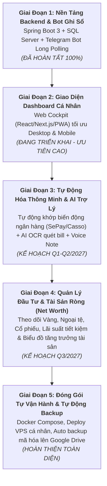
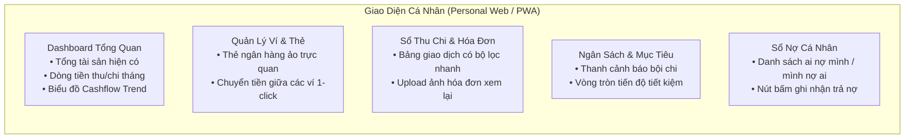
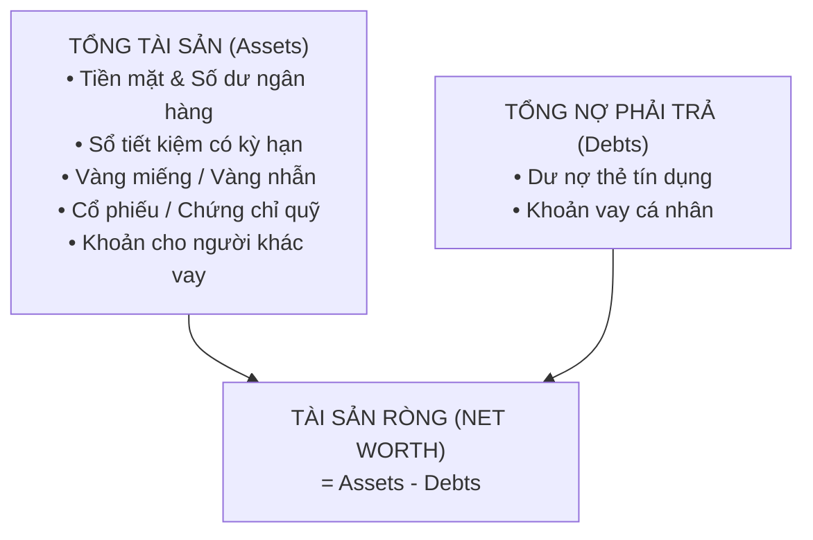

# 🗺️ Lộ Trình Phát Triển Dự Án (Personal Project Roadmap)
## Hệ Thống Trợ Lý Tài Chính Cá Nhân (Personal Financial Management System)

> **Mục đích sử dụng**: Phục vụ riêng cá nhân (Private / Self-hosted / Single-User)  
> **Phiên bản tài liệu**: 2.0.0 (Tối ưu hóa riêng cho nhu cầu cá nhân)  
> **Cập nhật lần cuối**: Tháng 10/2026  
> **Trọng tâm cốt lõi**: **"Tối đa tự động hóa – Ghi chép siêu tốc – Quản lý Tài sản ròng (Net Worth) toàn diện"**

---

## 🎯 1. Tầm Nhìn & Triết Lý Thiết Kế Cá Nhân

### 1.1. Tầm nhìn (Personal Vision)
Xây dựng một **"Trung tâm Điều hành Tài chính Cá nhân" (Personal Finance Cockpit)** độc bản, may đo chính xác theo thói quen sinh hoạt và danh mục tài sản của bản thân. Hệ thống giúp tôi kiểm soát toàn diện dòng tiền, theo dõi tài sản ròng và tự động hóa tối đa việc ghi chép để không bao giờ bị nản hay quên ghi sổ.

### 1.2. Triết lý thiết kế (Design Philosophy)
1. **Không ma sát (Zero-Friction Input)**: Thao tác nhập liệu phải nhanh nhất có thể (chụp ảnh hóa đơn, gửi tin nhắn/voice Telegram, hoặc tự động bắt biến động số dư ngân hàng).
2. **Dữ liệu thuộc về mình 100% (Data Sovereignty)**: Không lưu trữ tài chính nhạy cảm trên app bên thứ ba (Money Lover, Spendee...). Toàn bộ database nằm trên máy cá nhân hoặc VPS riêng, sao lưu tự động hàng ngày.
3. **Tinh gọn, dễ tự vận hành (Lean & Low-Maintenance)**: Không ôm đồm các tính năng nhiều người dùng (SaaS, chia tiền nhóm, phân quyền phức tạp). Tập trung vào sự ổn định, mượt mà và phục vụ đúng nhu cầu của bản thân.
4. **Theo dõi Tài sản ròng (Net Worth Focused)**: Không chỉ dừng lại ở thu chi hàng ngày, mà hướng tới quản lý bức tranh tài chính lớn (tiền tiết kiệm, các khoản nợ, tỷ giá ngoại tệ, vàng, danh mục đầu tư).

---

## 🧭 2. Sơ Đồ Tổng Quan Lộ Trình Cá Nhân

---

## 📊 3. Bảng Ma Trận Tiến Độ Cá Nhân

| Giai Đoạn | Tên Giai Đoạn | Giá Trị Mang Lại Cho Cá Nhân | Trạng Thái | Tiến Độ |
|:---:|:---|:---|:---:|:---:|
| **Phase 1** | **Core Backend & Telegram Bot** | Sẵn sàng toàn bộ logic tài chính, bot chat ghi chi tiêu cực nhanh trong 3 giây |  | **100%** |
| **Phase 2** | **Personal Web Cockpit (PWA)** | Giao diện trực quan xem dòng tiền, biểu đồ, ngân sách và sao kê mọi lúc mọi nơi |  | **30%** |
| **Phase 3** | **Tự Động Hóa & AI Trợ Lý** | Không cần nhập tay: Tự bắt thông báo ngân hàng, AI quét hóa đơn, Voice-to-Text |  | **0%** |
| **Phase 4** | **Quản Lý Tài Sản Ròng (Net Worth)** | Quản lý tiền gửi, vàng, nợ, ngoại tệ và biểu đồ gia tăng tài sản dài hạn |  | **0%** |
| **Phase 5** | **Self-Hosting & Auto Backup** | Đóng gói Docker 1-click lên VPS cá nhân, tự động sao lưu dữ liệu bảo mật 100% |  | **0%** |

---

## 🚀 4. Chi Tiết Kế Hoạch Từng Giai Đoạn

---

### 🟢 GIAI ĐOẠN 1: Nền Tảng Backend, Nghiệp Vụ & Bot Telegram
> **Trạng thái**: Đã hoàn thành (100% Core Ready)  
> **Mục tiêu**: Xây dựng toàn bộ khung xử lý nghiệp vụ tài chính chuẩn xác trên Java 21 & Spring Boot 3, tích hợp Bot Telegram chạy Long Polling để ghi chép hàng ngày.

#### ✅ Đã hoàn thiện và đưa vào sử dụng:
- [x] **Cơ sở dữ liệu & Ràng buộc toàn vẹn**:
  - Lưu trữ dữ liệu trên MS SQL Server, bảo vệ số dư bằng giao dịch nguyên tử `@Transactional`.
  - Không cho phép xóa nhầm ví nếu đã có lịch sử giao dịch sao kê.
- [x] **Quản lý toàn bộ Ví & Tài khoản cá nhân**:
  - Tiền mặt, Thẻ ngân hàng, Ví MoMo/ZaloPay, Thẻ tín dụng, Quỹ tiết kiệm, v.v.
- [x] **Ghi chép Thu – Chi – Chuyển khoản nội bộ**:
  - Hỗ trợ lưu trữ ảnh hóa đơn đính kèm.
  - Tự động hoàn tác (revert) số dư chuẩn xác khi xóa hoặc sửa giao dịch.
  - Hỗ trợ thẻ Tag để phân loại chi tiêu chi tiết theo sự kiện/dự án cá nhân.
- [x] **Ngân sách cá nhân (Budgets)**:
  - Giới hạn chi tiêu theo danh mục (Ăn uống, Mua sắm...) hoặc theo Tag.
  - Tự động tính tỷ lệ `%` đã tiêu và cờ cảnh báo vượt ngân sách.
- [x] **Mục tiêu Tiết kiệm (Saving Goals)**:
  - Tạo mục tiêu (Mua xe, Quỹ khẩn cấp...), ghi nhận nạp/rút từ ví, tự động đổi trạng thái khi đạt $100\%$.
- [x] **Sổ Nợ Cá Nhân (Debt Management)**:
  - Theo dõi tiền cho bạn bè/người thân mượn (Cho vay) hoặc tiền mình vay (Đi vay).
  - Ghi nhận trả nợ theo đợt, tính ngày quá hạn, tính năng tất toán/miễn nợ.
- [x] **Tác vụ tự động chạy ngầm (Cronjobs)**:
  - Chi phí định kỳ (tiền trọ, netflix, hóa đơn điện nước) tự động cộng/trừ đúng hạn mỗi ngày.
  - Tự động đồng bộ tỷ giá USD/VND trực tuyến hàng ngày.
- [x] **Hệ thống Phân tích & Báo cáo Tài chính**:
  - KPI Dashboard: Tổng thu, tổng chi, số tiền tiết kiệm ròng, tỷ lệ tiết kiệm (Savings Rate %).
  - Tự động loại trừ chuyển khoản nội bộ và trả nợ để báo cáo không bị tính trùng (double-counting).
  - Xuất báo cáo tài chính PDF chuyên nghiệp (tháng/năm).
- [x] **Bot Telegram Ghi Sổ Cá Nhân Siêu Tốc (24/7)**:
  - Chạy ngầm qua Java 21 HttpClient Long Polling (không cần mở port hay thuê tên miền).
  - Gõ tin nhắn tự nhiên bóc tách số tiền lẻ, danh mục, ví: `35k cafe momo`, `15tr luong vcb`, `125.500 sieu thi`.
  - Lệnh kiểm tra tài chính nhanh: `/sodu` (xem ví), `/homnay` (đã tiêu bao nhiêu), `/undo` (hoàn tác ngay nếu gõ nhầm).

---

### 🔵 GIAI ĐOẠN 2: Web Cockpit Cá Nhân & Tối Ưu Mobile (PWA)
> **Mục tiêu**: Xây dựng giao diện web trực quan, sang trọng, thiết kế theo chuẩn Dark Mode tài chính hiện đại để mở trên laptop khi xem báo cáo hoặc mở trên điện thoại (PWA) để thao tác nhanh.  
> **Thời gian dự kiến**: Quý 4/2026

#### Các hạng mục chi tiết:
- [ ] **Công nghệ**: Next.js 14 / React 18, Tailwind CSS, Shadcn UI, Recharts / Chart.js, Lucide Icons.
- [ ] **Màn hình Dashboard (Trung tâm tài chính cá nhân)**:
  - Card tổng hợp: **Tổng giá trị tài sản hiện có (VND & USD)**, Thu nhập tháng, Chi tiêu tháng, Tỷ lệ tiết kiệm tháng này.
  - Biểu đồ xu hướng dòng tiền (Cashflow Area Chart) theo từng ngày trong tháng.
  - Biểu đồ cơ cấu chi tiêu (Donut Chart) với top 5 khoản tiêu tốn tiền nhiều nhất.
  - Widget 6 giao dịch gần nhất & Danh sách số dư từng ví (VCB, MoMo, Tiền mặt...).
- [ ] **Màn hình Quản lý Ví (My Wallets)**:
  - Thiết kế các thẻ ví theo dạng Card ngân hàng đẹp mắt (hiển thị logo, số dư, loại ví).
  - Thao tác chuyển tiền nội bộ nhanh giữa 2 ví (kèm tự động tính lại số dư).
- [ ] **Màn hình Sổ Giao Dịch (Transactions)**:
  - Danh sách phân trang mượt mà, tìm kiếm nhanh theo ghi chú, lọc theo ngày, theo danh mục hoặc theo thẻ tag.
  - Xem lại ảnh chụp hóa đơn đính kèm trực tiếp trên giao diện.
- [ ] **Màn hình Ngân Sách & Mục Tiêu Tiết Kiệm**:
  - Progress bar đổi màu theo mức độ chi tiêu (Xanh $\rightarrow$ Vàng $\rightarrow$ Đỏ khi vượt hạn mức).
  - Danh sách mục tiêu tiết kiệm kèm ngày dự kiến hoàn thành.
- [ ] **Hỗ trợ PWA (Progressive Web App)**:
  - Cài đặt trực tiếp lên màn hình chính điện thoại (iPhone / Android) như một ứng dụng native.
  - Tải trang tức thì, giao diện tối ưu chạm vuốt (mobile-first).

---

### 🟡 GIAI ĐOẠN 3: Tự Động Hóa Tối Đa & AI Trợ Lý (Zero-Manual Input)
> **Mục tiêu**: Loại bỏ hoàn toàn việc phải nhớ để nhập tay. Hệ thống tự động thu thập thông tin qua Ngân hàng, Camera AI và Giọng nói.  
> **Thời gian dự kiến**: Quý 1 - Quý 2/2027

#### 1. Tự Động Bắt Biến Động Số Dư Ngân Hàng (Bank Webhooks)
- **Cơ chế**: Tích hợp dịch vụ webhook cá nhân (như SePay / Casso hoặc đọc thông báo SMS/App ngân hàng).
- **Trải nghiệm**:
  - Khi quẹt thẻ, chuyển khoản ngân hàng hoặc nhận lương tại Vietcombank/MB:
  - Webhook gửi dữ liệu về Backend `financial_management` $\rightarrow$ Hệ thống tự nhận diện ví, số tiền, ngày giờ $\rightarrow$ Tự động tạo giao dịch Thu/Chi tương ứng mà **không cần mở app**.
  - Telegram Bot gửi ngay thông báo: *"Đã ghi nhận giao dịch chi 120.000đ từ ví VCB cho 'TIEN COM TRUA'!"*

#### 2. AI OCR Đọc Hóa Đơn Tự Động (Smart Receipt Scanner)
- **Cơ chế**: Tích hợp Google Gemini Flash API (chi phí siêu rẻ hoặc miễn phí với hạn mức cá nhân).
- **Trải nghiệm**:
  - Đi siêu thị, ăn nhà hàng chỉ cần chụp ảnh bill và gửi thẳng vào Bot Telegram hoặc Web App.
  - Gemini AI phân tích hình ảnh và bóc tách tự động:
    - Tổng số tiền thanh toán.
    - Thời gian trên hóa đơn.
    - Tên quán / siêu thị (VinMart, Circle K, Highlands...).
    - Tự động gợi ý danh mục: Ăn uống (`Category 1`) hoặc Mua sắm (`Category 7`).
  - Người dùng chỉ cần bấm nút "Xác nhận" là xong!

#### 3. Voice-to-Text Ghi Chép Bằng Giọng Nói Trên Telegram
- Bấm giữ nút ghi âm trên Telegram khi đang lái xe hoặc bận tay: *"Đổ xăng xe máy 70 ngàn bằng tiền mặt"*.
- Backend tích hợp mô hình Whisper / Gemini Speech nhận diện giọng nói tiếng Việt $\rightarrow$ Bóc tách thành số tiền $70.000$, danh mục Di chuyển, ví Tiền mặt $\rightarrow$ Tự động lưu giao dịch.

#### 4. Cố Vấn Tài Chính & Báo Cáo Định Kỳ Hàng Ngày
- **Báo cáo 21:30 mỗi tối**: Bot Telegram tự động tổng hợp:
  > *"Hôm nay bạn đã tiêu 215.000đ (3 giao dịch). Tuần này bạn còn 850.000đ trong ngân sách Ăn uống. Chúc bạn ngủ ngon!"*
- **Cảnh báo thông minh**: Nhắc nhở khoản nợ sắp đến hạn, cảnh báo khi tốc độ chi tiêu trong tháng đang nhanh hơn 20% so với tháng trước.

---

### 🟠 GIAI ĐOẠN 4: Quản Lý Danh Mục Đầu Tư & Tài Sản Ròng (Net Worth)
> **Mục tiêu**: Mở rộng từ quản lý chi tiêu sinh hoạt thông thường sang quản lý bức tranh tài sản ròng lớn (Net Worth = Tổng Tài Sản - Tổng Nợ).  
> **Thời gian dự kiến**: Quý 3/2027

#### Các hạng mục chi tiết:
- [ ] **Module Tài Sản Đầu Tư (Investment Portfolio)**:
  - **Vàng**: Lưu trữ số lượng (chỉ/lượng), giá mua vào; tự động cập nhật giá vàng SJC/Doji hàng ngày để tính lãi/lỗ danh nghĩa.
  - **Tiền gửi tiết kiệm (Term Deposits)**: Quản lý kỳ hạn gửi (3 tháng, 6 tháng, 1 năm), lãi suất `%`, tự tính ngày đáo hạn và số tiền lãi dự kiến nhận được.
  - **Chứng khoán / Quỹ (Stocks / Funds)**: Quản lý danh mục mã cổ phiếu, giá vốn, cập nhật lãi/lỗ (PnL) theo thị trường.
- [ ] **Báo cáo Biến Động Tài Sản Ròng (Net Worth Growth)**:
  - Biểu đồ tăng trưởng tài sản ròng theo tháng/quý/năm.
  - Đo lường mức độ tự do tài chính: Tính toán số tháng có thể sinh sống dựa trên quỹ khẩn cấp hiện có mà không cần đi làm.

---

### 🟣 GIAI ĐOẠN 5: Tự Vận Hành Cá Nhân, Docker Hóa & Auto Backup
> **Mục tiêu**: Toàn bộ hệ thống chạy tự động, độc lập, bảo mật tối đa và không lo mất dữ liệu.  
> **Thời gian dự kiến**: Quý 4/2027

#### Các hạng mục chi tiết:
- [ ] **Docker Compose 1-Click Deployment**:
  - Đóng gói toàn bộ: Spring Boot App + MS SQL Server / PostgreSQL + Web Frontend + Nginx SSL trong 1 file `docker-compose.yml`.
  - Có thể chạy trên máy tính cá nhân ở nhà (Homelab / Mini PC) hoặc thuê 1 VPS giá rẻ (Cloud Server).
- [ ] **Hệ Thống Tự Động Sao Lưu Dữ Liệu Cá Nhân (Auto Backup & Encryption)**:
  - Cronjob lúc `02:00 sáng`: Tự động dump toàn bộ Database `financial_management`.
  - Nén file backup bằng 7zip với mật khẩu mã hóa AES-256.
  - Tự động đẩy file backup lên Google Drive cá nhân hoặc gửi thẳng file nén về kênh Telegram Private riêng của bạn.
  - Đảm bảo dù máy chủ hỏng ổ cứng, dữ liệu vẫn được bảo toàn $100\%$.
- [ ] **Bảo Mật Cá Nhân**:
  - Giới hạn quyền truy cập quản trị qua VPN nội bộ (Tailscale / WireGuard) hoặc xác thực 2 lớp (2FA qua Google Authenticator).

---

## 📅 5. Bảng Tóm Tắt Các Mốc Phiên Bản Cá Nhân (Personal Milestones)

| Phiên Bản | Mốc Dự Kiến | Mục Tiêu Chính Phục |
|---|:---:|---|
| **v1.0.0** *(Hiện tại)* | 10/2026 | **Xong Backend Core**: 12 Controller, Bot Telegram bóc tách thu chi tiếng Việt 24/7, xuất PDF báo cáo. |
| **v1.2.0** | 12/2026 | **Web Cockpit PWA**: Màn hình Dashboard trực quan, xem ví, lọc giao dịch, biểu đồ dòng tiền trên laptop & điện thoại. |
| **v1.5.0** | 02/2027 | **Ngân Sách & Mục Tiêu Trực Quan**: Đầy đủ thanh đo ngân sách, tiến độ tiết kiệm, sổ nợ và xuất báo cáo so sánh tháng. |
| **v2.0.0** | 05/2027 | **Tự Động Hóa Thông Minh**: Tự bắt biến động số dư ngân hàng (Vietcombank/MB), AI Gemini đọc hóa đơn từ ảnh chụp. |
| **v2.5.0** | 08/2027 | **Quản Lý Tài Sản Ròng**: Theo dõi Vàng, Lãi tiết kiệm có kỳ hạn, Cổ phiếu và biểu đồ tăng trưởng Net Worth. |
| **v3.0.0** | 11/2027 | **Hoàn Hảo Độc Bản**: Đóng gói Docker Compose lên VPS, Tự động mã hóa sao lưu DB lên Google Drive hàng đêm. |

---

## 💡 6. Thói Quen Vận Hành Hàng Ngày Đề Xuất Cho Cá Nhân

1. **Khi phát sinh chi tiêu ngoài đường**:
   - Gõ nhanh 1 dòng tin nhắn Telegram: `35k cafe momo` hoặc chụp ảnh hóa đơn gửi vào bot.
2. **Khi chuyển khoản ngân hàng**:
   - Hệ thống tự động bắt webhook và ghi nhận, bot gửi thông báo xác nhận.
3. **Mỗi tối 21:30**:
   - Xem nhanh tin nhắn tổng kết ngày từ Telegram bot để biết hôm nay đã tiêu bao nhiêu.
4. **Cuối mỗi tuần / Cuối tháng**:
   - Mở Web Dashboard trên laptop xem biểu đồ dòng tiền, đối soát ngân sách các danh mục và tải file PDF lưu trữ.
5. **Đầu tháng mới**:
   - Kiểm tra mục tiêu tiết kiệm, cập nhật số dư đầu tư và điều chỉnh ngân sách sinh hoạt cho tháng tiếp theo.

---

> 📝 *Lộ trình này được thiết kế riêng cho bạn để đảm bảo tính thực tế, nhẹ nhàng và bền vững trong việc duy trì kỷ luật tài chính cá nhân lâu dài.*
