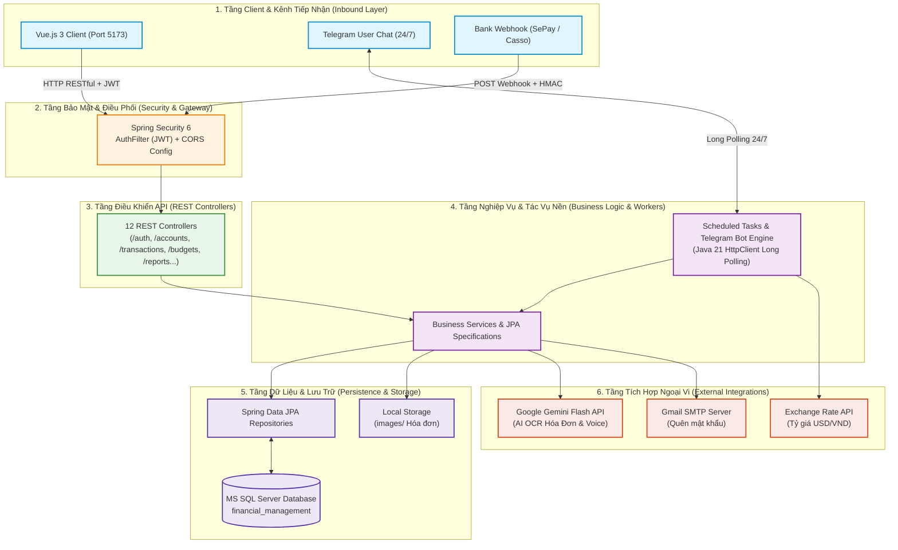
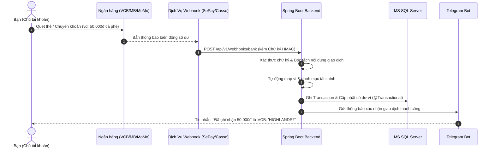

# 🗺️ Lộ Trình Phát Triển Backend & Hệ Thống API (Backend & API Roadmap)
## Hệ Thống Trợ Lý Tài Chính Cá Nhân (Financial Management Backend API)

> **Mục đích sử dụng**: Phục vụ riêng cá nhân (Private / Self-hosted / Single-User)  
> **Phạm vi tài liệu**: Tập trung 100% vào **Kiến trúc Backend**, **Đặc tả API**, **Các cổng kết nối dịch vụ (Integrations)** và **Lộ trình nâng cấp Server** (Frontend Vue.js phát triển ở repository độc lập)  
> **Backend Stack**: **Java 21** + **Spring Boot 3.5.5** + **MS SQL Server** + **Spring Security 6 (JWT)** + **Telegram Bot API**  
> **Frontend kết nối**: Vue.js 3 + Vite (`http://localhost:5173`)  
> **Phiên bản tài liệu**: 3.0.0 (Backend & API Focused)  
> **Cập nhật lần cuối**: Tháng 10/2026  

---

## 🏗️ 1. Kiến Trúc Tổng Thể & Các Cổng Kết Nối Dịch Vụ (Architecture & Integrations)

Backend đóng vai trò là **Bộ não trung tâm (Core Brain)**, xây dựng theo mô hình **Kiến trúc Phân tầng (Layered Architecture)** kết hợp kiến trúc hướng sự kiện cho Telegram & Webhooks:



### 📋 Chi tiết vai trò từng tầng kiến trúc:

| Tầng Kiến Trúc | Thành phần chính | Trách nhiệm & Vai trò |
|---|---|---|
| **1. Client & Inbound Layer** | Vue.js App, Telegram App, Webhook Providers | Điểm tương tác của người dùng và các bên thứ ba gửi dữ liệu vào hệ thống. |
| **2. Security & Gateway** | Spring Security 6, `AuthFilter`, `WebConfig` (CORS) | Chặn lọc truy cập trái phép, giải mã JWT Token, kiểm tra quyền hạn, cấu hình CORS cho phép Vue App (`localhost:5173`) kết nối an toàn. |
| **3. REST Controller Layer** | 12 Controllers (`TransactionController`, `AccountController`,...) | Tiếp nhận HTTP Request, validate dữ liệu đầu vào (Bean Validation), đóng gói phản hồi chuẩn `AbstractResponse<T>`. |
| **4. Business Logic & Workers** | Services, JPA Specifications, Cronjobs, Telegram Engine | Xử lý logic nghiệp vụ tài chính, đảm bảo giao dịch nguyên tử `@Transactional`, chạy ngầm cronjob định kỳ và điều phối bot Telegram. |
| **5. Persistence & Storage** | Spring Data JPA Repositories, MS SQL Server, Disk Storage | Truy vấn dữ liệu hiệu năng cao, đảm bảo toàn vẹn dữ liệu sao kê, lưu trữ hình ảnh hóa đơn tại thư mục `images/`. |
| **6. External Integrations** | Gemini AI, Gmail SMTP, Exchange Rate API | Mở rộng tính năng tự động: đọc hóa đơn qua AI, gửi mail xác thực và cập nhật tỷ giá thị trường. |

---

## 📡 2. Bảng Đặc Tả Kết Nối Ngoại Vi (Integrations Contract)

| Tên Dịch Vụ / Client | Phương Thức Kết Nối | Giao Thức / Cổng | Mục Đích Sử Dụng |
|---|---|---|---|
| **Frontend Vue.js** | RESTful HTTP / CORS | `http://localhost:5173` | Cung cấp toàn bộ dữ liệu giao dịch, ví, ngân sách, báo cáo tài chính qua chuẩn `AbstractResponse<T>`. |
| **Telegram Bot API** | Long Polling | HTTPS qua `HttpClient` (Java 21) | Nhận lệnh chat ghi sổ nhanh, tra cứu số dư, hoàn tác giao dịch 24/7 mà không cần mở port modem. |
| **Bank Webhooks** *(Phase 3)* | Inbound Webhook POST | `POST /api/v1/webhooks/bank` | Tự động bắt biến động số dư Vietcombank, MB, MoMo qua SePay/Casso (xác thực chữ ký bí mật HMAC). |
| **Google Gemini API** *(Phase 3)* | Google Cloud REST / SDK | HTTPS API Key | AI OCR bóc tách ảnh hóa đơn (tổng tiền, danh mục, thời gian) và nhận diện giọng nói (Voice-to-Text). |
| **Gmail SMTP** | JavaMailSender | SMTP `587` (TLS) | Gửi email khôi phục mật khẩu có mã token tạm thời hạn 15 phút. |
| **Currency Exchange** | Open Exchange REST | HTTPS API | Đồng bộ tỷ giá ngoại tệ USD/VND tự động lưu vào DB mỗi ngày. |
| **Google Drive Backup** *(Phase 5)* | Drive API v3 / Rclone CLI | Background Job | Sao lưu bản dump database mã hóa AES-256 lúc 02:00 sáng mỗi ngày. |

---

## 📊 3. Ma Trận Lộ Trình Phát Triển Backend (Backend Roadmap Matrix)

| Giai Đoạn | Tên Giai Đoạn | Trọng Tâm Backend & API | Trạng Thái | Tiến Độ |
|:---:|:---|:---|:---:|:---:|
| **Phase 1** | **Core Backend & Telegram Bot** | Xây dựng 12 Controllers, Entity, SQL Server, Auth JWT, Cronjobs, Telegram Bot |  | **100%** |
| **Phase 2** | **Tối Ưu Hóa API Cho Frontend Vue.js** | CORS, Contract Response, API Widgets, Phân trang Specification, Swagger OpenAPI, Global Error Handling, Image URLs |  | **100%** |
| **Phase 3** | **Webhook Ngân Hàng & Tích Hợp AI** | Endpoint Webhook bắt số dư ngân hàng, Gemini Vision OCR đọc bill, Voice Whisper |  | **0%** |
| **Phase 4** | **Backend Quản Lý Tài Sản Ròng (Net Worth)** | Entity & Service Vàng, Tiền gửi tiết kiệm kỳ hạn, Cổ phiếu, API Báo cáo Net Worth |  | **0%** |
| **Phase 5** | **Tối Ưu Hiệu Năng, Caching & Auto-Backup** | Redis Cache, Flyway DB Migration, Docker Compose, Script Auto Backup mã hóa |  | **0%** |

---

## 🚀 4. Chi Tiết Lộ Trình Backend & API

---

### 🟢 GIAI ĐOẠN 1: Nền Tảng Backend Cốt Lõi & Telegram Bot (Core Ready)
> **Trạng thái**: Đã hoàn thành 100%  
> **Mục tiêu**: Xây dựng toàn bộ nền móng dữ liệu, logic luân chuyển dòng tiền và bộ API chuẩn mực trên Spring Boot 3 & Java 21.

#### ✅ Các module đã hoàn thiện:
- [x] **Kiến trúc dữ liệu & Bảo mật cơ bản**:
  - `User`, `Account`, `Transaction`, `Budget`, `Debt`, `DebtPayment`, `SavingGoal`, `SavingGoalContribution`, `Tag`, `CurrencyExchange`.
  - Spring Security 6 với `AuthFilter` xác thực JWT stateless.
  - Mã hóa mật khẩu nhiều lớp: BCrypt kết hợp Custom Salt độc lập.
  - SMTP Mail service gửi link đặt lại mật khẩu với token tạm thời (15 phút).
- [x] **Nghiệp vụ luân chuyển tiền nguyên tử (ACID `@Transactional`)**:
  - Tự động cộng/trừ số dư ví khi tạo giao dịch Thu, Chi, Chuyển khoản nội bộ (`transfer`).
  - Hoàn tác (revert) số dư chuẩn xác khi xóa hoặc sửa giao dịch.
  - Chặn xóa ví nếu đã có lịch sử giao dịch.
- [x] **Hệ thống phân tích báo cáo (Report Engine)**:
  - Tự động loại trừ giao dịch chuyển khoản nội bộ (`Category 16`) và Trả nợ (`Category 9`) để chống tính trùng (double-counting).
  - API trả về KPI (Tổng thu, tổng chi, net savings, savings rate %, quy đổi USD).
  - API chuỗi điểm dữ liệu biểu đồ xu hướng dòng tiền theo ngày (`chartPoints`).
  - Xuất báo cáo PDF tháng/năm qua iText.
- [x] **Telegram Bot Long Polling**:
  - Tự động lắng nghe cập nhật qua Java 21 `HttpClient` Long Polling không cần mở port modem.
  - Bộ bóc tách NLP tiếng Việt thông minh cho số tiền lẻ, danh mục và tên ví.
  - Các lệnh tra cứu nhanh: `/sodu`, `/homnay`, `/thangnay`, `/undo`.

---

### 🔵 GIAI ĐOẠN 2: Tối Ưu Hóa API Phục Vụ Frontend Vue.js
> **Thời gian dự kiến**: Quý 4/2026 (Đã hoàn thành 100% ✅)  
> **Mục tiêu**: Đảm bảo các API endpoint, định dạng dữ liệu (DTO contract) và cơ chế bảo mật hoạt động ăn khớp 100% với Frontend Vue.js chạy tại `http://localhost:5173`.

#### 1. Chuẩn Hóa API Contract & Cấu Hình Kết Nối (CORS & Auth):
- [x] Cấu hình CORS chặt chẽ trong `SecurityConfig.java` & `WebConfig.java` với danh sách whitelist origins cấu hình động qua `app.cors.allowed-origins` (`http://localhost:5173,http://localhost:4173,http://localhost:8080,http://127.0.0.1:5173`).
- [x] Chuẩn hóa toàn bộ cấu trúc phản hồi bọc trong vỏ `AbstractResponse<T>`:
  ```json
  {
    "data": { ... },
    "success": true,
    "code": 200,
    "message": null,
    "executionTimeInSeconds": 0.015
  }
  ```
- [x] Bổ sung cơ chế xử lý lỗi nhất quán (`GlobalExceptionHandler`):
  - Chuẩn hóa lỗi Validation (`MethodArgumentNotValidException` và `@Valid` trên toàn bộ các Request DTOs: SignUp, ForgotPassword, Account, Budget, Transfer, UserProfile...) trả về HTTP 422 kèm map chi tiết các trường bị lỗi.
  - Xử lý mã lỗi `401 Unauthorized` và `403 Forbidden` rõ ràng để Axios Interceptor của Vue tự động điều hướng sang trang đăng nhập.
  - Đồng bộ hóa toàn bộ response 401 từ `AuthFilter` qua Jackson `ObjectMapper` thay vì Gson.
  - Ẩn hoàn toàn `stackTrace` trong các response lỗi môi trường production.

#### 2. Các API Phục Vụ Riêng Cho Giao Diện Vue.js Dashboard:
- [x] **`GET /dashboard?month={m}&year={y}` (Dashboard Aggregation API)**: API tổng hợp gom 5 khối dữ liệu trọng yếu (KPI 8 chỉ số, chart xu hướng theo ngày, danh sách thẻ ví, tổng hợp ngân sách sử dụng, và 6 giao dịch gần nhất) trong 1 request duy nhất để Vue render tức thì màn hình Dashboard.
- [x] `GET /accounts/all`: Trả về danh sách thẻ ví kèm số dư để hiển thị lên lưới thẻ card ngân hàng ảo.
- [x] `GET /transactions/{accountId}/recent`: Lấy nhanh 6 giao dịch gần nhất của ví phục vụ widget trang chủ.
- [x] `POST /transactions/filter`: Lọc nâng cao kết hợp phân trang (`PageResponse<TransactionResponse>`) hỗ trợ bảng dữ liệu Vue có thanh tìm kiếm, chọn khoảng ngày, chọn ví, chọn tag.
- [x] `GET /budgets/checking`: Trả về số tiền đã chi, số dư còn lại và `% usedPercentage` để render thanh tiến độ Bootstrap/Vue đổi màu.
- [x] `GET /budgets/summary`: Tổng hợp ngân sách toàn kỳ và tỷ lệ đã dùng %.
- [x] `GET /reports/analytics`: Cung cấp 8 chỉ số KPI và danh sách `chartPoints` để component biểu đồ của Vue (Chart.js / ECharts) vẽ trực tiếp mà không cần tính toán lại ở frontend.
- [x] `POST /reports/export/month` & `/reports/export/year`: Stream byte array file PDF để Vue tải về hoặc xem trước trực tiếp trên browser.

#### 3. Upload File & Phục Vụ Ảnh Hóa Đơn Tĩnh:
- [x] Endpoint `POST /transactions/create` và `POST /transactions/{id}` nhận file ảnh hóa đơn qua `multipart/form-data` (giới hạn 20MB).
- [x] Endpoint tĩnh phục vụ file ảnh hóa đơn: Cấu hình Spring Boot `ResourceHandler` để Vue App có thể hiển thị ảnh hóa đơn qua URL trực tiếp `http://localhost:8080/images/{filename}`, kèm trường `imageUrl` đầy đủ trong `TransactionResponse`.
- [x] Hệ thống kiểm thử tự động (Unit Tests) bao phủ Exception Handling, Jackson Config, AuthFilter, Cors, ResourceHandler, AbstractResponse và Dashboard API với tỷ lệ đạt 100%.

---

### 🟡 GIAI ĐOẠN 3: Tích Hợp Webhooks Ngân Hàng & Dịch Vụ AI
> **Thời gian dự kiến**: Quý 1 - Quý 2/2027  
> **Mục tiêu**: Xây dựng các cổng kết nối API thông minh giúp tự động ghi nhận thu chi mà không cần người dùng nhập tay.



#### Các hạng mục API & Backend chi tiết:
- [ ] **Module Webhook Tiếp Nhận Biến Động Số Dư Ngân Hàng (`BankWebhookController`)**:
  - Endpoint `POST /api/v1/webhooks/bank` tiếp nhận payload thông báo chuyển khoản/trừ tiền từ SePay/Casso.
  - **Bảo mật Webhook**: Kiểm tra chữ ký bí mật (HMAC SHA-256 header) để đảm bảo request gửi đến thực sự từ dịch vụ ngân hàng, chặn tấn công giả mạo dữ liệu.
  - **Quy tắc phân loại tự động**: Bóc tách nội dung chuyển khoản để nhận diện mã ví (VCB, MB, Techcombank) và tự động gắn danh mục chi tiêu/thu nhập.
- [ ] **Tích hợp Google Gemini Flash API cho OCR Hóa Đơn (`GeminiAiService`)**:
  - Tạo service gọi Gemini 1.5 Flash Vision API qua REST/SDK.
  - Endpoint `POST /transactions/scan-receipt`: Tiếp nhận file ảnh hóa đơn $\rightarrow$ Gửi lên Gemini kèm structured prompt (JSON Schema) $\rightarrow$ Trả về JSON chuẩn hóa: `{ amount: 154000, date: "2026-10-08", merchant: "WinMart", suggestedCategory: 1, note: "Mua thuc pham" }`.
- [ ] **Tích hợp Nhận Diện Giọng Nói (Speech-to-Text Service)**:
  - Telegram bot nhận file tin nhắn thoại `.oga` $\rightarrow$ Backend chuyển đổi sang text qua OpenAI Whisper hoặc Gemini Audio $\rightarrow$ Chuyển văn bản qua `TelegramMessageParser` để tự động tạo giao dịch.
- [ ] **Cronjob Thông Báo & Cảnh Báo Tài Chính Cá Nhân**:
  - Tác vụ định kỳ quét lúc `21:30` mỗi tối: Tổng hợp thu chi trong ngày và gửi bản tin tóm tắt qua Bot Telegram.
  - Cảnh báo tự động gửi qua Telegram ngay khi một danh mục chi tiêu vượt quá $90\%$ ngân sách đã đề ra.

---

### 🟠 GIAI ĐOẠN 4: Backend Quản Lý Danh Mục Đầu Tư & Tài Sản Ròng (Net Worth API)
> **Thời gian dự kiến**: Quý 3/2027  
> **Mục tiêu**: Mở rộng các thực thể (Entities) và APIs để quản lý bức tranh tài sản ròng lớn (Net Worth = Tổng Tài Sản - Tổng Nợ).

#### 1. Thiết Kế Entity & Bảng CSDL Mới:
- `GoldAsset`: Quản lý vàng (Loại vàng: SJC, Nhẫn 9999; Số chỉ/lượng; Giá mua vào; Ngày mua).
- `TermDeposit`: Quản lý sổ tiết kiệm có kỳ hạn (Số tiền gốc, Kỳ hạn tháng, Lãi suất %/năm, Ngày gửi, Ngày đáo hạn, Phương thức tái tục: Gốc + Lãi hoặc Chỉ gốc).
- `StockAsset`: Quản lý cổ phiếu/chứng chỉ quỹ (Mã CK, Số lượng, Giá vốn trung bình).
- `NetWorthSnapshot`: Bảng lưu vết lịch sử tổng tài sản ròng theo từng mốc thời gian để vẽ đồ thị tăng trưởng tài sản dài hạn.

#### 2. Dịch Vụ Thu Thập Giá Thị Trường Tự Động:
- Cronjob định kỳ hàng ngày fetch giá vàng SJC/Doji và chỉ số giá cổ phiếu để cập nhật định giá danh mục đầu tư theo giá thị trường (Mark-to-Market).

#### 3. Danh Sách Endpoint Mới (Net Worth API):
- `GET /net-worth/summary`: Trả về tổng giá trị tài sản ròng hiện tại (tiền mặt + ngân hàng + tiết kiệm + vàng + đầu tư - nợ phải trả).
- `GET /net-worth/history?period=1y`: Lấy chuỗi dữ liệu lịch sử biến động tài sản ròng theo tháng để vẽ biểu đồ tăng trưởng tài sản trên Frontend.
- `GET /investments/gold/all`: Danh sách các chỉ/lượng vàng đang sở hữu kèm giá trị thị trường và lãi/lỗ tạm tính.
- `GET /investments/deposits/all`: Danh sách sổ tiết kiệm, tính toán số tiền lãi tích lũy dự kiến tới ngày đáo hạn.

---

### 🟣 GIAI ĐOẠN 5: Tối Ưu Hạ Tầng, Caching, Docker & Tự Động Sao Lưu (DevOps & Self-Hosting)
> **Thời gian dự kiến**: Quý 4/2027  
> **Mục tiêu**: Đóng gói toàn bộ Backend thành khối độc lập, hiệu năng cao, dễ deploy lên máy chủ cá nhân (VPS / Mini PC) và tự động sao lưu dữ liệu tuyệt đối an toàn.

#### 1. Bộ Nhớ Đệm (Caching với Redis):
- Tích hợp `spring-boot-starter-data-redis`.
- Caching tỷ giá ngoại tệ USD/VND và giá vàng để tránh gọi API ngoài liên tục.
- Caching các báo cáo tài chính của các tháng cũ (vì dữ liệu tháng cũ đã chốt sổ, ít biến động).
- Triển khai Redis Token Blacklist phục vụ API Đăng xuất (`POST /auth/logout`) hủy hiệu lực JWT token ngay lập tức.

#### 2. Quản Lý Phiên Bản Database (Flyway):
- Tích hợp Flyway Migration thay cho cơ chế `spring.jpa.hibernate.ddl-auto=update`.
- Đảm bảo toàn bộ cấu trúc bảng, ràng buộc khóa ngoại, triggers (từ file `financial_management.sql`) được kiểm soát phiên bản qua các file script `V1__init.sql`, `V2__add_net_worth.sql`.

#### 3. Đóng Gói Docker Compose:
- Tạo `Dockerfile` đa tầng (multi-stage build):
  - Stage 1: Build source bằng Maven JDK 21.
  - Stage 2: Chạy trên Eclipse Temurin JRE 21 Alpine siêu nhẹ (dung lượng < 200MB).
- Tạo file `docker-compose.yml` liên kết:
  - `backend-app` (Spring Boot 3 - port 8080).
  - `database` (MS SQL Server / PostgreSQL).
  - `redis` (Cache & Token Blacklist - port 6379).

#### 4. Kịch Bản Tự Động Sao Lưu Dữ Liệu An Toàn 100% (Auto Backup Script):
- Tạo shell script / Cronjob chạy lúc `02:00 sáng`:
  1. Dump toàn bộ database `financial_management`.
  2. Nén file backup bằng thuật toán mã hóa AES-256 kèm mật khẩu bảo mật riêng.
  3. Tự động upload file nén lên Google Drive cá nhân (qua Google Drive API / Rclone) hoặc đẩy về kênh Telegram Private riêng của bạn.
  4. Tự động dọn dẹp các bản backup cũ hơn 30 ngày để tiết kiệm dung lượng.

---

## 📋 5. Kế Hoạch Phiên Bản Backend (Backend Release Milestones)

| Phiên Bản | Mốc Thời Gian | Trọng Tâm Bàn Giao Backend |
|---|:---:|---|
| **v1.0.0** *(Hiện tại)* | 10/2026 | **Hoàn thành Core Backend**: 12 Controllers, JWT Auth, MS SQL Server, PDF Report, Cronjob tỷ giá & định kỳ, Telegram Bot long polling. |
| **v1.1.0** | 11/2026 | **Tối ưu kết nối Vue Client**: Hoàn thiện CORS `5173`, chuẩn hóa Global Error Handler, API ảnh hóa đơn tĩnh, đồng bộ API contract. |
| **v2.0.0** | 04/2027 | **Tự động hóa & AI Engine**: Endpoint Bank Webhook (SePay/Casso), Gemini Flash Vision OCR đọc hóa đơn, Speech-to-Text tin nhắn thoại. |
| **v2.5.0** | 08/2027 | **Net Worth & Investment APIs**: Entity & API quản lý Vàng, Sổ tiết kiệm kỳ hạn, Lãi suất, Crawl giá thị trường, Biểu đồ Net Worth. |
| **v3.0.0** | 11/2027 | **Production Ready & Self-Hosted**: Redis Caching, Flyway DB Migration, Docker Compose trọn bộ, Auto Backup database mã hóa lên Cloud. |

---

> 💡 *Tài liệu này là đặc tả kỹ thuật và lộ trình độc lập của Backend Spring Boot. Mọi cập nhật về API endpoints và schema sẽ được đồng bộ lên tài liệu Swagger UI tại `http://localhost:8080/swagger-ui/index.html`.*
